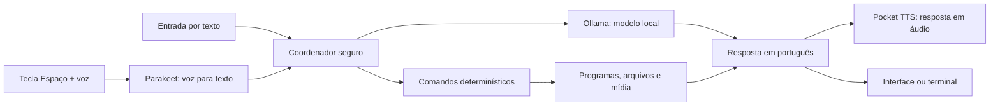

# Jarvis Brasileiro com Upgrade

Assistente local em português para Windows, com entrada e saída por voz,
interface flutuante, modelos executados pelo Ollama e ferramentas controladas
para trabalhar no computador.

O projeto foi pensado para executar a inteligência principal localmente. A
internet é usada na instalação dos componentes e quando o usuário pede uma
pesquisa na web.

## O que ele pode fazer

### Conversa e voz

- entender e responder em português do Brasil;
- transcrever voz localmente com NVIDIA Parakeet;
- responder em áudio com Pocket TTS;
- usar a voz incorporada `rafael` ou uma amostra configurada localmente;
- funcionar por texto ou por voz;
- ouvir somente enquanto a barra de espaço estiver pressionada;
- exibir uma interface flutuante com fundo transparente.

### Programas e mídia

- localizar e abrir aplicativos registrados no Menu Iniciar;
- fechar Calculadora, Bloco de Notas, Paint, Chrome, Edge, Firefox, Câmera,
  Arduino IDE, CorelDRAW e Consumer;
- pedir confirmação antes de fechar programas que podem ter trabalho não salvo;
- proteger o Explorador de Arquivos contra fechamento por voz;
- aumentar, diminuir ou silenciar o volume;
- pausar, continuar e trocar a faixa de mídia.

### Arquivos

- criar arquivos de texto, Markdown, CSV, JSON e código-fonte;
- perguntar onde salvar quando a pasta não for mencionada;
- salvar automaticamente em `Documentos`, `Downloads` ou `Área de Trabalho`
  depois da resposta do usuário;
- ler, abrir, procurar e adicionar conteúdo a arquivos;
- pedir confirmação antes de substituir ou apagar;
- rejeitar caminhos externos, travessia de diretório, links simbólicos e hard
  links que possam escapar das pastas autorizadas.

### Agentes locais

- memória local de conversas e fatos em SQLite;
- pesquisa semântica opcional em documentos autorizados;
- agente programador para criar e alterar projetos isolados;
- suporte a Python, JavaScript, TypeScript, HTML, Java, C, C++, C#, Go, Rust,
  PHP, Ruby, Kotlin, Swift, Lua, Dart, R, SQL, JSON, YAML e Markdown;
- compilação com ferramentas confiáveis já instaladas;
- descompactação segura de ZIP, TAR, TAR.GZ e TGZ;
- agente instalador limitado a um catálogo validado do `winget`;
- pesquisa pública na web quando uma resposta local não for suficiente.

## Como funciona



1. A voz é transformada em texto localmente.
2. O coordenador verifica primeiro se o pedido corresponde a uma ferramenta
   autorizada.
3. Comandos do computador usam funções determinísticas; texto criado pelo
   modelo não é executado como PowerShell ou Prompt de Comando.
4. Perguntas normais seguem para o modelo local do Ollama.
5. A resposta aparece na interface e, quando habilitado, é falada pelo TTS.

## Exemplos de comandos

```text
Abra a calculadora.
Feche o Chrome.
Confirmar.
Crie um arquivo chamado compras.txt contendo café e arroz.
Downloads.
Leia o arquivo compras.txt nos downloads.
Procure o arquivo relatório julho.
Aumente o volume.
Ative o modo profundo.
Lembre que meu editor preferido é o VS Code.
Pesquise na web as notícias de tecnologia de hoje.
```

## Privacidade e segurança

Este repositório não contém gravações de voz, bancos de memória, credenciais,
logs, caminhos de usuário ou configurações de um computador específico.

- a memória fica no perfil local do usuário;
- documentos não são indexados automaticamente;
- exclusões e substituições exigem confirmação separada;
- fechamento de programas com possível trabalho não salvo exige confirmação;
- execução e compilação de projetos usam uma área isolada;
- instalações aceitam somente pacotes previstos no catálogo;
- arquivos `.env`, áudio, bancos locais e logs são bloqueados pelo `.gitignore`.

Leia também [PRIVACY.md](PRIVACY.md).

## Requisitos

- Windows 10 ou Windows 11;
- Python 3.11 de 64 bits;
- Git;
- Ollama;
- microfone para entrada por voz;
- aproximadamente 15 GB livres para ambiente Python e modelos;
- internet durante a instalação e para pesquisas web.

Uma GPU compatível melhora o desempenho, mas os modelos leves também podem
funcionar em CPU.

## Instalação completa no Windows

### 1. Instale os programas básicos

Instale:

- [Python 3.11](https://www.python.org/downloads/);
- [Git para Windows](https://git-scm.com/download/win);
- [Ollama para Windows](https://ollama.com/download/windows).

Durante a instalação do Python, habilite a opção para adicionar o Python ao
`PATH`. Depois das instalações, feche e abra novamente o PowerShell.

Confirme os programas:

```powershell
python --version
git --version
ollama --version
```

### 2. Baixe o Jarvis

```powershell
git clone https://github.com/clebertressi88/jarvis-brasileiro-com-upgrade.git
cd jarvis-brasileiro-com-upgrade
```

### 3. Crie o ambiente Python

Não é necessário alterar a política de execução do PowerShell:

```powershell
python -m venv venv
.\venv\Scripts\python.exe -m pip install --upgrade pip
.\venv\Scripts\python.exe -m pip install -r requirements.txt
```

A instalação inclui PyTorch, Pocket TTS, NVIDIA NeMo, PyWebView e as demais
dependências. O processo pode demorar e baixar vários gigabytes.

### 4. Baixe e prepare os modelos locais

Modelo rápido e modelo de programação:

```powershell
ollama pull qwen2.5-coder:3b
ollama create jarvis:3b-fast -f jarvis_llm/Modelfile-fast.txt
```

Modelo de memória semântica:

```powershell
ollama pull nomic-embed-text
```

Modelo profundo opcional, mais lento e de melhor qualidade:

```powershell
ollama pull qwen3:4b
ollama create jarvis:4b-pt -f jarvis_llm/Modelfile-no-tools.txt
```

O modelo de transcrição é baixado automaticamente pelo NVIDIA NeMo na primeira
execução com microfone. O Pocket TTS também prepara os arquivos necessários na
primeira resposta falada.

### 5. Autorize o microfone

No Windows, abra **Configurações > Privacidade e segurança > Microfone** e
permita o acesso ao microfone para aplicativos da área de trabalho. Essa
permissão deve ser concedida manualmente pelo usuário.

### 6. Inicie o assistente

Voz, resposta falada, interface flutuante e ativação pela barra de espaço:

```powershell
.\venv\Scripts\python.exe jarvis.py --input voice --output voice --interface ui --push-to-talk on
```

Mantenha a barra de espaço pressionada enquanto fala e solte ao terminar.

Modo texto no terminal:

```powershell
.\venv\Scripts\python.exe jarvis.py --input text --output text --interface cli
```

Entrada por texto com resposta falada:

```powershell
.\venv\Scripts\python.exe jarvis.py --input text --output voice --interface cli
```

## Voz personalizada opcional

A voz `rafael` é usada por padrão. Para usar uma amostra própria, mantenha o
arquivo somente no computador e defina a variável antes de iniciar:

```powershell
$env:JARVIS_VOICE_SAMPLE = "C:\caminho-local\voz.wav"
.\venv\Scripts\python.exe jarvis.py --input voice --output voice --interface ui --push-to-talk on
```

Não adicione gravações de voz ao Git.

## Configuração dos modelos

As seguintes variáveis de ambiente permitem trocar modelos e limites sem
editar o código:

- `JARVIS_CHAT_MODEL`;
- `JARVIS_QUALITY_MODEL`;
- `JARVIS_CODE_MODEL`;
- `JARVIS_EMBED_MODEL`;
- `JARVIS_CONTEXT_WINDOW`;
- `JARVIS_RECENT_INTERACTIONS`.

## Atualizar uma instalação existente

```powershell
git pull
.\venv\Scripts\python.exe -m pip install -r requirements.txt
```

Se algum `Modelfile` tiver mudado, recrie o perfil correspondente com
`ollama create`.

## Testes

```powershell
.\venv\Scripts\python.exe -m unittest discover -s tests -p "test_*.py"
```

O teste de link simbólico pode ser ignorado quando o Windows não permite criar
links simbólicos sem Modo de Desenvolvedor ou privilégio elevado. Isso não é
uma falha funcional do Jarvis.

## Limitações atuais

- o fechamento por voz é limitado aos programas mapeados;
- RAR e 7Z não são extraídos automaticamente;
- elevação de administrador e aprovação de UAC nunca são automatizadas;
- o agente programador trabalha dentro de uma pasta dedicada;
- a pesquisa web envia somente a consulta pública e bloqueia consultas que
  pareçam conter caminhos, segredos ou dados locais.

## Origem e licenças

Este trabalho deriva do projeto público
[tudormatei/jarvis-local](https://github.com/tudormatei/jarvis-local) e inclui
adaptações para português, interface flutuante, memória local, ferramentas do
computador e controles adicionais de segurança.

O projeto original não fornece um arquivo de licença. Verifique as condições
aplicáveis antes de redistribuir ou usar comercialmente. Modelos e componentes
de terceiros mantêm suas próprias licenças e termos.
